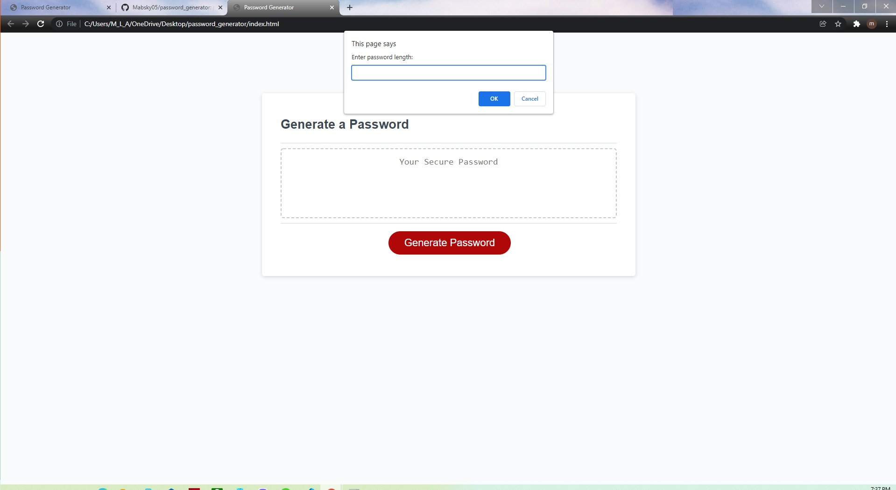

# Password Generator

## Summary
Page for generating passwords through a series of prompts

## Description / Instructions
Upon loading: Display of interface with "Generate Password" button.

Clicking on the button will initiate a series of prompts to create a password.

Parameters include:  
Number of characters (8 < x < 128)  
Lowercase characters  
Uppercase characters  
Numbers  
Special characters  

Confirming all prompts will display password in alert box. 

## Contact
grimdango@gmail.com

## Log 

### 04/02/21
File restructuring.

### 27/02/21
Major revisions, reload function.

### 16/12/21
Partial revisions.   

### 14/12/21
First commit. 
   

